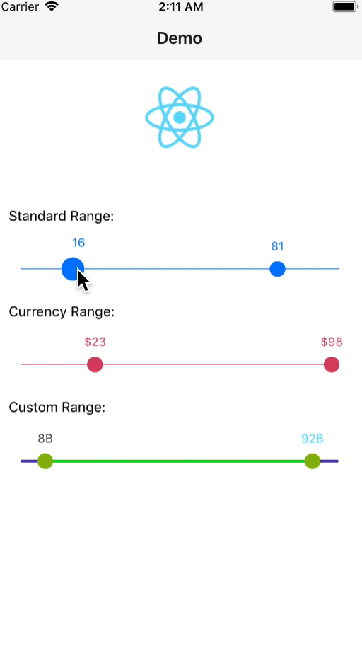
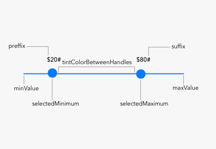

<h2 align="center">React Native Range Slider</h2>
<p align="center">The high-quality native iOS range slider</a> for <a href="https://facebook.github.io/react-native/">react native.</a> A slider, similar in style to UISlider, but which allows you to pick a minimum and maximum range.

<b>Note: This slider can also be used as a normal slider with only one handle.<br><br><br></b>
<p align="center">
  <a href="https://github.com/ismnoiet/example_RN_range_slider">Demo</a>
</p>

<p align="center">
  
</p>

<p align="center">
  
</p>


## Getting Started

1. Installation

   * Using npm: `npm install --save react-native-range-slider`
   * Using yarn: `yarn add react-native-range-slider`

2. Link
   * Run `react-native link react-native-range-slider`
   * If linking fails, follow the
     [manual linking steps](https://facebook.github.io/react-native/docs/linking-libraries-ios.html#manual-linking)

## Usage

If you want a working example you can check [this example](https://github.com/ismnoiet/example_RN_range_slider), otherwise you can use the following example as a starting point.

```javascript
import RangeSlider from 'react-native-range-slider'
```

```JSX
<View style={{flex: 1, flexDirection: 'row'}}>
  <RangeSlider
    minValue={0}
    maxValue={100}
    tintColor={'#da0f22'}
    handleBorderWidth={1}
    handleBorderColor="#454d55"
    selectedMinimum={20}
    selectedMaximum={40}
    style={{ flex: 1, height: 70, padding: 10, backgroundColor: '#ddd' }}
    onChange={ (data)=>{ console.log(data);} }
  />
</View>
```
## API

| Property |      Description      |  Type  |
|----------|:-------------:|----------|
| disableRange |  when set to true, the slider will mimic a normal slider with only one handle and the slider value will be stored in selectedMaximum | Boolean, false by default |
| minValue |  the minimum value for the slider | Number(float) |
| maxValue |  the maximum value for the slider   |   Number(float) |
| selectedMinimum | the selected minimum value, it shouldn't be less than `minValue`  |    Number(float) |
| selectedMaximum | the selected maximum value, it shouldn't be bigger than `maxValue`  |    Number(float) |
| onChange | a callback that will be called with slider data once the values change   |    Callback |
| tintColor | the color for the slider bar and the two handlers   |    String(**MUST BE A HEX VALUE**) |
| handleColor | the color for both `selectedMinimum` and `selectedMaximum`  handlers |    String(**MUST BE A HEX VALUE**) |
| handleBorderColor | the color for the slider handle border   |    String(**MUST BE A HEX VALUE**) |
| handleBorderWidth | the width for the slider handle border   |    Number(float) |
| handleDiameter | the diameter for the slider handle   |    Number(float) default 16.0 |
| tintColorBetweenHandles | the color of the slider bar between the `selectedMinimum` and `selectedMaximum` handlers   |    String(**MUST BE A HEX VALUE**) |
| minLabelColour | the color of the min label on top of `selectedMinimum` handler |    String(**MUST BE A HEX VALUE**) |
| maxLabelColour | the color of the max label on top of `selectedMaximum` handler |    String(**MUST BE A HEX VALUE**) |
| lineHeight | the height for slider bar | Number(float) default 1.0) |
| preffix | the string to be prepended to min and max labels values  |    String |
| suffix | the string to be appended to min and max labels values  |    String |
| hideLabels | a boolean to determine handle labels visibility, if set to true range labels will be hidden  |    Boolean |


## Todo

   - [x] Add possibility to update handlers related properties.
   - [x] Impliment other necessary methods.
   - [x] Improve the documentation.
   - [x] Make the module cooler.
   - [ ] Add android support.


## Acknowledgement

   * <a href="https://github.com/TomThorpe/TTRangeSlider">TTRangeSlider</a>, which this module is based on.

## How to contribute ?
You are interested and want to contribute? Awesome, just consider the following steps:

1. Fork this repository.
2. Add and test the fixes/improvements you worked on to a seperate branch.
3. Submit your pull request(PR).