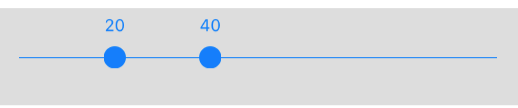

<h2 align="center">React Native Range Slider</h2>
<p align="center">The high-quality native iOS range slider</a> for <a href="https://facebook.github.io/react-native/">react native.</a> A slider, similar in style to UISlider, but which allows you to pick a minimum and maximum range.

<p align="center">
  
</p>


## Getting Started

1. Installation

   * Using npm: `npm install --save react-native-range-slider`
   * Using yarn: `yarn add react-native-range-slider`

2. Link
   * Run `react-native link react-native-range-slider`
   * If linking fails, follow the
     [manual linking steps](http://facebook.github.io/react-native/docs/linking-libraries-ios.html#manual-linking)

## Usage

```javascript
import RangeSlider from 'react-native-range-slider'
```

```JSX
<View style={{flex: 1, flexDirection: 'row'}}>
 <RangeSlider
   exampleProp="awesome stuff"
   minValue={0}
   maxValue={100}
   selectedMinimum={20}
   selectedMaximum={40}
   style={{ flex: 1, height: 70, padding: 10, backgroundColor: '#ddd' }}
   onChange={this.priceChange}
 />
</View>
```

## Todo

   * Add possibility to update markers color related properties.
   * Impliment other necessary methods.
   * Improve the documentation and add examples.
   * Make the module cooler.


## Credits

   * Thanks to the creator of the module <a href="https://github.com/TomThorpe/TTRangeSlider">TTRangeSlider</a>, which this module is based on.

## How to contribute ?
You are interested and want to contribute? Awesome, just consider the following steps:

1. Fork this repository.
2. Add and test the fixes/improvements you want to add
3. Submit your pull request(PR).